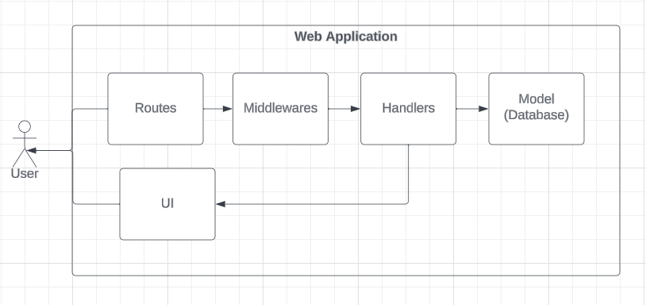

Go Creditplus
=========================================
Credit application created with the Golang programming language.

## How to Run

### 1. Run DB
```
$ docker-compose up -d --build
```

### 2. Copy Env
```
$ cp .envrc.example .envrc
```

### 3. Install golang-migrate
```
$ curl -L https://github.com/golang-migrate/migrate/releases/download/v4.14.1/migrate.linux-amd64.tar.gz | tar xvz
$ mv migrate.linux-amd64 $GOPATH/bin/migrate
$ migrate -version
4.14.1
```

### 4. Migrate
```
$ make db/migration/up
```

### 5. Run Application
```
$ make run/web
```

### 6. Enjoy ☕
* Access: http://localhost:3300
* Account:

  | NIK           | Password   |
  |---------------|------------|
  | 1411502550123 | p@ssw0rd24 |
  | 1411502550827 | p@ssw0rd24 |

###  Run Test (Optional)
```
$ make audit
```

## Routers
| Path              | Description                | Login Required |
|-------------------|----------------------------|----------------|
| /                 | Redirect to /catalogs      | false          |
| /catalogs         | Get all products           | false          |
| /catalogs/:id     | Get detail a product       | false          |
| /catalogs/:id/buy | Buy a product              | true           |
| /dashboard        | Show detail Logged-in user | true           |
| /login            | Login user                 | false          |
| /logout           | Logout Logged-in user      | true           |


## Architectures
### Application


### Database


## Contributors
* Agung Yuliyanto: [Github](https://github.com/agung96tm), [LinkedIn](https://www.linkedin.com/in/agung96tm/)
